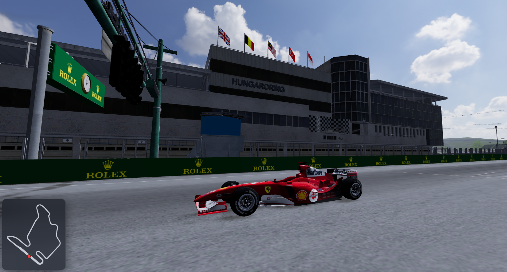

# Racing



Böngészőben futó autóverseny-játék valós pályákkal és autókkal. Three.js
megjelenítés, Rapier fizika, Node.js szerver, WebSocket multiplayer és opcionális
MySQL/MariaDB ranglista.

Az assetkészlet több mint **270 autót** és **25 pályát** tartalmaz, hat
környezetben — és folyamatosan bővül. A menü ezeket nem beégetett listából, hanem
a szerver által felépített asset-manifestből olvassa, ezért az új modellek
automatikusan megjelennek.

Szándékosan nincs itt pontos darabszám: hetente változna, és egy elavult szám
rosszabb, mint a nagyságrend. A mindenkori pontos értéket az
`npm run verify:assets` írja ki.

## Indítás

Követelmény: Node.js 20 vagy újabb.

```bash
npm install
npm start
```

Ezután a játék a **http://localhost:3000** címen érhető el.

Fejlesztés közben automatikus Node-újraindítással:

```bash
npm run dev
```

Apache és PHP helyben nem kell: ugyanaz a Node folyamat szolgálja ki a statikus
fájlokat, a REST API-t és a WebSocket kapcsolatot.

MySQL/MariaDB opcionális. Ha elérhető, a szerver létrehozza a szükséges táblákat,
és megőrzi a játékosokat, köridőket, eredményeket és szellemköröket. Adatbázis
nélkül is elindul a játék, csak ezek nem maradnak meg. A beállításokhoz másold a
`.env.example` fájlt `.env` néven.

Tesztek:

```bash
npm test
```

A teljes helyi assetkészlet ellenőrzése deploy előtt:

```bash
npm run verify:assets
```

Ez ellenőrzi többek között a JSON-okat, az autómodellek és manifestek
összhangját, a compressed méretkorlátot, a kerék-regexeket, valamint az aktív
pályák rajtpontjait, kapuit, zónatérképét és ütközési fájlját. A nagy modellek
gitignore-osak, ezért teljes assetkészlet nélküli friss klónban a parancs
szándékosan hibát jelez.

## Nyelvek

A felület az alábbi nyelveken érhető el; a menü jobb felső sarkában lévő
legördülő vált köztük, és a választás megmarad a következő indulásra.

Magyar · English · Deutsch · Español · Français · Italiano · Português ·
Nederlands · Polski · Čeština · Slovenčina · Slovenščina · Hrvatski · Srpski ·
Română · Русский · Українська · Türkçe · 日本語 · 简体中文 · 한국어

A szövegek a `web/lang/<kód>.json` fájlokban élnek, nyelvenként pontosan ugyanazzal
a kulcskészlettel. A HTML-ben `data-i18n` attribútumok jelölik a fordítandó
elemeket. A nyelvek nevei mindig a SAJÁT nyelvükön szerepelnek, zászló nélkül —
egy zászló országot jelöl, nem nyelvet.

A tesztcsomag őrzi, hogy egyik fájlból se hiányozzon és egyikben se maradjon
felesleges kulcs.

## Játékmódok

### Egyjátékos

Hagyományos verseny választható körszámmal. A rajtvonalat és a checkpointokat
sorrendben kell teljesíteni. A kihagyott checkpoint, a teljes pályaelhagyás és
egyes szabálytalan mozgások érvénytelenítik az aktuális kört, de a játék folytatódik.

### Időmérés

Körszámkorlát nélküli Hot Lap mód külön időmérő rajtponttal. Indulás előtt a
ranglistáról választható szellemkocsi, de szellem nélkül is elindítható. A delta
az aktuális checkpointnál a kiválasztott szellemhez, vagy szellem nélkül az előző
saját körhöz viszonyít.

A szellemkocsi nem vesz részt a fizikában, így nem lehet vele ütközni. Ugyanazt a
legfeljebb 5 MB-os optimalizált modellt használja, mint a multiplayer ellenfelei,
de sima, szemcsézés nélküli áttetszőséggel jelenik meg. Az új szellemkörök 20 Hz-en
rögzülnek; a korábbi 10 Hz-es rekordok változatlanul visszajátszhatók.

### Többjátékos

Legfeljebb 8 játékos versenyezhet egy szobában. A szoba lehet publikus, ekkor
megjelenik a szobakeresőben, vagy privát, ekkor a hatjegyű kóddal lehet belépni.
A host választja ki a pályát, a körszámot és a szabályokat, majd elindítja a futamot.

A verseny csak akkor számol vissza, amikor minden csatlakozott játékos betöltött,
vagy lejárt a 60 másodperces betöltési időkorlát. A középső értesítés név szerint
mutatja, kire várunk; ha már minden játékos kész, „Várakozás a rajtra…” jelenik meg.
Egy megszakadt kapcsolat nem tartja bent korlátlanul a többieket.

Normál módban az autók ütköznek. A választható **Ghost mód** kikapcsolja az
autó–autó ütközést. Célba érés után a játék automatikusan nézői módba vált; a
következő gombbal a még versenyző játékosok között lehet lépkedni. A nézett autó
teljes vizuális és hangfrissítést kap akkor is, ha távol van.

## Kötelező kerékcsere

A szabály az Egyjátékos és Többjátékos módhoz kapcsolható be; Időmérésben nincs
értelme, ezért ott nem aktív.

- A boxbejárat átlépése után a rendszer legfeljebb 100 km/h-ra lassítja az autót.
- Minden rajthelyhez saját, azonos sorszámú boxhely tartozik.
- A saját boxhelyen 3 másodpercig folyamatosan állni kell.
- A boxkijárat átlépése után megszűnik a sebességkorlátozás és a már teljesített
  kerékcsere értesítése eltűnik.
- A kiállás bármelyik körben teljesíthető.
- Aki nem áll ki, annak az utolsó köre érvénytelen lesz, de a versenyt befejezheti.
- Egykörös futamban, illetve hiányos boxkonfiguráció esetén a szabály automatikusan
  inaktív, így nem tud hibásan érvényteleníteni egy futamot.

Egy teljes boxkonfigurációhoz legalább egy bejárat, legalább egy kijárat és
pontosan 8 boxhely szükséges. Bejáratból és kijáratból több vonal is megadható.

## Irányítás

- `W` / `↑`: gáz
- `S` / `↓`: fék, kis sebességnél tolatás
- `A`, `D` / `←`, `→`: kormányzás
- `Space`: kézifék
- `C`: kamera
- jobb egérgomb + húzás: körbenézés
- `R`: visszahelyezés az utolsó szabályosan érintett checkpoint környékére
- `M`: némítás
- `F9`: az aktuális multiplayer netcode-riport letöltése

Az `R` csak az első rajtvonal-átlépés után használható. Ha a checkpointot aszfalton
lépte át az autó, oda kerül vissza, ahol áthaladt; pályán kívüli átlépésnél a
checkpoint közepére. A szerver engedélyezett teleportként kezeli, ezért önmagában
nem érvényteleníti a kört.

Mobilon külön kormány-, gáz- és fékgombok jelennek meg.

## Architektúra

```text
web/          publikus kliens és assetek; élesben közvetlenül Apache szolgálja ki
server/       helyi statikus kiszolgálás, REST API, WebSocket és versenyvezérlés
shared/       kliens és szerver által közösen használt fizika és szabályok
tools/        autóelemző, kerékfelismerő és modelloptimalizáló eszközök
car-masters/  nagy autók nem publikus, teljes minőségű forrásmodelljei
test/         Node tesztcsomag
```

A saját autó fizikáját a játékos böngészője számolja fix 60 Hz-en, ezért a
kormányzás nem vár hálózati válaszra. A kliens 30 Hz-en küldi az állapotát; a
szerver ellenőrzi a mozgást, kezeli a rajtot, checkpointokat, köröket,
boxkiállást, eredményeket és szellemeket, majd 20 Hz-es snapshotokat továbbít.

A távoli autók késleltetett, adaptív interpolációval jelennek meg. A korrekció,
a kerékanimáció, a hang és a frissítési gyakoriság távolságfüggő; a nézett autó
mindig kivétel a ritkítás alól. A részletes ellenfélmodellek a töltőképernyő
alatt tényleges GPU-draw-val melegszenek elő. A könnyű F1-modell csak tartósan
rossz képkockaidőnél kapcsol be, egyetlen renderakadás nem cseréli le a kiválasztott
skint. A helyi főszálakadás nem kerülhet sem a ping-, sem a snapshot-jitter
becslésébe, a renderórák pedig hosszú képkocka után a megengedett puffermélységre
állnak vissza ahelyett, hogy másodpercekig vagy percekig késleltetnék az autók képét.

Az autó–autó ütközés nem mozgatható távoli Rapier-testekkel készül. Minden kliens
csak a saját autóját oldja fel a távoli, hálózati pózokból képzett közös F1-es
kapszula-hitboxok ellen. A söpört vizsgálat nagy sebességnél is kizárja az
áthaladást, a kontakt csak vízszintes sebességet és yaw-t módosíthat, a helyzet-
korrekciót pedig a valódi pályafal ellen külön alaklekérdezés korlátozza. Így a
távoli autó nem tolható falba, majd rántódhat vissza a következő snapshottal.

A szerver mozgásellenőrzése nem rúgja ki a játékost: valódi szabálytalanságnál az
aktuális kört érvényteleníti. A küszöbök számolnak a nagy sebességű pályákkal,
csomagtorlódással, pillanatnyi pingtüskékkel és a szabályos visszahelyezéssel.

A szobák memóriában élnek, mert folyamatosan változnak és szerver-újraindítás után
értelmüket vesztik. Az adatbázisba csak a tartós adatok kerülnek.

### Sorvégek

A repó **LF** sorvéget használ, a `.gitattributes` kényszeríti ki minden gépen
(`* text=auto eol=lf`). Erre azért van szükség, mert a Git for Windows telepítője
rendszerszinten `core.autocrlf=true`-t állít: az LF-fel tárol, de CRLF-fel ír ki,
amitől minden LF-fel író szerkesztő azonnal „módosítottnak" mutatja a fájlokat —
és amitől néhány, a forrást mintaillesztéssel daraboló teszt friss klónon
elbukott. A kód Linuxon fut, ahol a CRLF aktívan árt, és a projektben nincs
egyetlen Windows-specifikus szkript sem.

A verziókövetett binárisokat (`*.png`, `*.glb`, `*.bin`, `*.hdr`, `*.exe`) a
`.gitattributes` kimondottan `binary`-nak jelöli. A git NUL-heurisztikája
egyébként felismerné őket, de egy elrontott bináris néma hiba lenne.

## Hálózati késleltetés tesztelése

Localhoston mesterséges ping és jitter kapcsolható az URL-ből:

```text
http://localhost:3000/?lag=150&jitter=30
```

Az értékek ezredmásodpercben, teljes oda-vissza útra értendők. Diagnosztika a
böngésző konzoljában:

```text
__mp.pingMs
__mp.jitterMs
__mp.interpDelayMs
__mp.predDelayMs
__mp.remoteLowDetail
__mp.snapshotTransitDropped
__mp.rawPos
__mp.interpPos
```

Multiplayer közben a kliens egy fix méretű körpufferben őrzi az utolsó 30
másodperc ping-, snapshot-, állapotküldési, fizikaidőzítési és képkocka-adatait.
Az `F9` egy JSON-riportba tölti le ezeket és a legutóbbi automatikusan megőrzött
pingtüske-, főszálakadás-, kapcsolatvesztés- vagy szervervalidációs pillanatokat.
A riport megadja a tényleges GPU-t, pixelarányt és rajzolási felbontást, valamint
a feltorlódott snapshotok, a helyi fizikai puffer és a kamera helyreállításának
mérőszámait is.
A riport nem tartalmaz játékosnevet, szobakódot, belépési tokent vagy szerveres
üzenetszöveget; fájl- és JSON-készítés csak az `F9` megnyomásakor történik.

### Későbbi helyi fizikai munka

A helyi fizikai ciklus nagyobb átalakítása és a saját autó rövid vizuális
extrapolációja szándékosan nincs vakon bekapcsolva. Egyik sem szabadítja fel
önmagában a főszálat: az ütemező átalakítása ugyanazt a Rapier-munkát számolná,
az extrapoláció pedig csak a meglévő állapotok közti képet becsülné. A teljes
fizika Web Workerbe költöztetése valóban levenné ezt a munkát a főszálról, de
nagy refaktor, és egy blokkoló renderelés alatt attól még nem készülne új kép.

Az F9-riport ezért külön méri a fizikai lépések idejét és késését, a saját
megjelenítési puffer kifogyását, valamint a kamera lemaradását. Ha a képkockák
még elkészülnek, miközben a fizikai időzítő vagy a helyi puffer rendszeresen
éhezik, következő lépésként képkockához igazított fix lépéses ütemezést kell
kipróbálni. Saját autós, legfeljebb egy tickes extrapoláció csak ezután indokolt;
Workerre pedig akkor érdemes váltani, ha a mérés szerint maga a fizika terheli
érdemben a főszálat.

## Fejlesztői mód

A menü **Fejlesztői mód** gombja szabad kamerás pályaszerkesztőt nyit.

### Zónák

Aszfalt, kifutó, opcionális láthatatlan fal és simítási terület jelölhető:

- ecsettel, állítható sugárral;
- pontonként körberajzolt, kitölthető poligonnal;
- a pálya anyagainak elemzéséből automatikusan generálva.

A **simítási terület** nem a vezetésre hat, hanem az ütközési háló sütésére: az
aszfalt-simítás csak az itt megjelölt részen dolgozik. Jelölés nélkül a teljes
aszfaltra fut, ami hosszú, sík szakaszokon jó, de egy döntött oválon épp a
felület lényegét vinné el.

A valódi falakat és kerítéseket elsősorban a pályamodellből sütött
`collision.bin` kezeli. A falzóna csak olyan extra lezárásokhoz kell, ahol nincs
megfelelő 3D geometria; attól még nem hiba, ha egy pálya alig használja.

### Rajtpontok, kapuk és boxutca

- Legfeljebb 8 normál rajtpont helyezhető el és forgatható.
- Külön időmérő rajtpont adható meg; hiányában a 8. normál rajthely az alapérték.
- A rajtvonal és bármely korábbi checkpoint utólag kijelölhető, mozgatható,
  átméretezhető és forgatható.
- Vezetővonal rajzolható az automatikus checkpoint-generáláshoz.
- Több boxbejárat és boxkijárat, valamint 8 számozott boxhely szerkeszthető.

### Ütközési háló

Az **Ütközés bekészítése** a pálya geometriájából `collision.bin` fájlt készít.
Multiplayerhez ez kötelező, mert a szerver és minden kliens ugyanazt az ütközési
hálót használja. Szűrhetőek az apró törmelékek, simíthatóak a rázókövek és
kizárhatóak a magas lombkoronák.

### Objektumvágó

Letöltött pályamodellekben gyakran maradnak oda nem illő darabok: placeholder
dobozok a rajtrácson, lebegő törmelék. Az **Objektumvágó** módban rájuk kattintva
a vele **összefüggő** darabot jelöli ki — nem az egész hálót —, és kivágja.

A vágás nem törlés, hanem elfajult háromszög: mindhárom index ugyanarra a csúcsra
mutat, aminek nincs felülete, a GPU eldobja. Ezért a puffer HOSSZA nem változik,
és a GLB bájtra pontosan, helyben javítható — a textúrák, kiterjesztések és
eltolások érintetlenek maradnak, újrakódolás nélkül. A mentés a böngésző
letöltésén keresztül adja vissza a módosított modellt.

Vágás után érdemes újrasütni az ütközési hálót. Gyakran kiderül, hogy a
kivágott dobozok eleve nem is voltak benne: a törmelékszűrő már korábban
kiszedte őket, mert különálló darabok.

### Autókerék-tesztelő

Az autót helyben mutatja forgó és kormányzott kerekekkel. Itt a `W`/`S` és a
fel/le nyíl végiglépteti az autókat; a normál menüben ezek a billentyűk nem
változtatják meg a kiválasztást.

## Autók feldolgozása

Az új autók teljes automatikus feldolgozása külön lépésekből áll.

### Játékosmodellek optimalizálása

```bash
npm run cars:optimize
```

A 20 MB fölötti eredeti modelleket a nem publikus `car-masters/` mappában őrzi
meg, és legfeljebb 15 MB-os játékosmodellt készít belőlük. A kisebb autókat nem
duplázza feleslegesen.

### Multiplayer- és szellemmodellek

```bash
npm run cars:compress
```

Minden autóból legfeljebb 5 MB-os változatot készít a
`web/assets/cars/compressed/` mappába. Ha van master, abból dolgozik, nem a már
optimalizált játékosmodellből. A játék ezt használja a multiplayer ellenfeleihez
és az időmérő szellemkocsihoz.

Egy konkrét autó újragenerálása:

```bash
npm run cars:compress -- 2008_bmw_sauber_f1.08 --force
```

### Kerékkonfigurációk

```bash
npm run cars:wheels
```

Megírja a hiányzó `wheelPattern` konfigurációkat, de a már kézzel javítottakat
nem írja felül. Egy autó kényszerített újraelemzése:

```bash
npm run cars:wheels -- 2024_ford_mustang_gt3 --force
```

Az eredményt mindig érdemes a fejlesztői autókerék-tesztelőben ellenőrizni.
Részletes algoritmus és további kapcsolók: [tools/README.md](tools/README.md).

## Új pálya hozzáadása

Egy pálya mappája a `web/assets/maps/<pálya-id>/` könyvtárban él. A teljes
konfiguráció jellemzően:

```text
<pálya-id>.glb       látható pályamodell
collision.bin        előre sütött fizikai geometria
spawn.json           legfeljebb 8 rajthely
hotlap_spawn.json    külön időmérő rajtpont
gates.json           rajtvonal és checkpointok
pit.json             boxbejáratok, boxkijáratok és 8 boxhely
zonemap.png          aszfalt/kifutó/fal térkép
zonemap.json         a zónatérkép koordinátái
bake.json            az ütközési háló sütési beállításai
```

A JSON- és PNG-fájlok Gitben vannak. A nagy `*.glb` és `*.bin` fájlok gitignore-osak,
ezért új pálya élesítésekor ezeket külön fel kell tölteni a VPS azonos mappájába.
Ezután a Node szolgáltatást újra kell indítani, mert az asset-manifest gyorsítótárazott.

## Éles kiszolgálás

Az éles Node rendszer systemd szolgáltatásként fut. Apache kezeli a HTTPS-t,
közvetlenül szolgálja ki a statikus fájlokat, és csak az API/WebSocket kéréseket
proxyzza Node-hoz. A pontos első telepítés, `.env`, jogosultságok, assetfeltöltés,
frissítés és hibakeresés leírása: [DEPLOY.md](DEPLOY.md).

Kódfrissítéskor általában Git pull és a `racing` szolgáltatás újraindítása kell.
Új vagy módosított gitignore-os assetet külön is fel kell tölteni; önmagában a
Git pull nem viszi fel a GLB, BIN, HDR és többi nagy modellfájlt.

## Jelenlegi korlátok

- A pályamodellek nagyok, jelenleg nagyjából 40–195 MB közöttiek, ezért egy új
  pálya első betöltése lassabb lehet. A tartalomverziózott, egyéves böngészőcache
  miatt a következő betöltés lényegesen gyorsabb.
- A saját autó fizikája kliensoldali, ezért autó–autó ütközésnél két játékos
  képernyője pillanatnyilag eltérhet. A szerver ettől függetlenül hitelesen kezeli
  a versenyszabályokat és eredményeket.

## Licenc

A projekt saját forráskódja zárt, proprietary szoftver. Minden jog fenntartva;
a kód használata, másolása, módosítása vagy terjesztése előzetes írásos engedély
nélkül nem megengedett. A részletes feltételeket a [LICENSE](LICENSE) tartalmazza.

A külső könyvtárak, valamint az autó-, pálya- és környezetmodellek nem tartoznak
automatikusan ezen feltételek alá: azokra a saját licenceik és felhasználási
feltételeik vonatkoznak.
